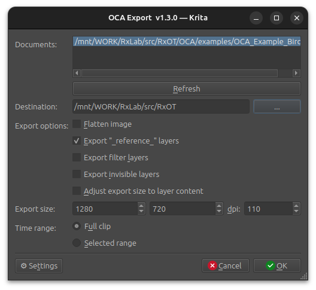

# OCA for Krita

[*OCA*, the Open Cel Animation format](http://rxlaboratory.org/tools/oca/) is an open format to ease the exchange of traditionnal/frame-by-frame/cel animation between different applications.

It is able to export all animation keyframes from a Krita document, keeping the layer structure, blending modes, and a lot of other information. This *OCA* format can then be imported in another application like *Adobe After Effects* or [*Blender*](http://blender.org).

The documentation about *OCA* is available on [oca.rxlab.guide](http://oca.rxlab.guide).

This is the ***OCA* exporter for Krita**.

► **[Download it from RxLab](http://rxlaboratory.org/tools/oca-for-krita/)**.

## Features

This *OCA* exporter will export the most common features of all drawing/animation software:

- Exports the layers or the flattened image
- Layer Groups (and pass through mode if any)
- Layer Labels
- Layer Visibility
- Keyframes and their duration (animation exposure)
- Opacity Keyframes
- Blending Modes (see [this table](blending-modes.md) for a list)
- Layer Sizes and Coordinates
- [Tag layers](layer-tags.md) to automatically *merge*, *ignore*, or set them as *references*.
- Document background color
- Document color depth

## Table of Contents

- [Installation](install.md)
- [Use layer tags](layer-tags.md)
- [List of supported blending modes](blending-modes.md)
- [Settings](settigns.md)

## License

### Software

**Copyright (C)  2020-2022 Nicolas Dufresne and Contributors.**  
This program is free software; you can redistribute them and/or modify them under the terms of the GNU General Public License as published by the Free Software Foundation; either version 3 of the License, or (at your option) any later version.

This program is distributed in the hope that it will be useful, but WITHOUT ANY WARRANTY; without even the implied warranty of MERCHANTABILITY or FITNESS FOR A PARTICULAR PURPOSE. See the GNU General Public License for more details.

You should have received a copy of the *GNU General Public License* along with *DuBuilder*. If not, see [http://www.gnu.org/licenses/](http://www.gnu.org/licenses/).

### This Documentation

**Copyright (C)  2020-2022 Nicolas Dufresne and Contributors.**  
Permission is granted to copy, distribute and/or modify this document under the terms of the GNU Free Documentation License, Version 1.3 or any later version published by the Free Software Foundation;  
with no Invariant Sections, no Front-Cover Texts, and no Back-Cover Texts.
A copy of the license is included in the section entitled "[Documentation License](licenses/gfdl.md)".

 
